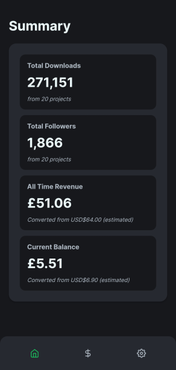
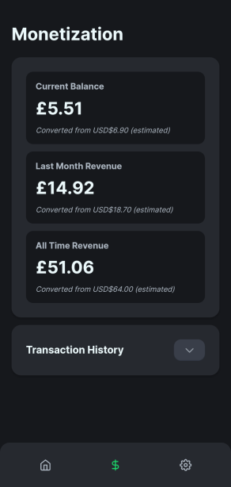
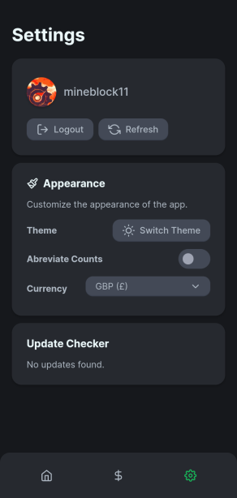

# Modrinth Publisher Dashboard

An unofficial android (and IOS if you want) app to track your modrinth statistics.

<div align="center">
  
  
  
</div>

- Uses [Omorphia](https://omorphia.modrinth.com/) for Vue components.
- Uses [CapacitorJS+Ionic](https://capacitorjs.com/) to compile the vue web app to android.

### Contents

- [Features](#features)
- [Development](#development)
- [IOS Support](#ios-support)

## Features

- Payout section
  + [x] Total revenue
  + [x] This months revenue
  + [x] Transaction History
  + [ ] Create new transaction
  + [x] Dynamic Currency Conversion
- Project section
  Some items in this section wont be available until they're added to knossos.
  + [x] Total downloads
  + [ ] This months downloads
  + [x] Total follows
  + [ ] This months follows
- [ ] Notification section
- Settings Section
  + [x] Theme Switcher
  + [ ] Account Switcher (hotswap between multiple accounts)
  + [ ] Push Notifications

## Development

If you wish to contribute to the UI stuff, all you need to do is:

```bash
pnpm install
ionic serve
```

If you wish to push a debug apk to your android device, you will need to run the following:

```bash
pnpm install
ionic capacitor run android
```
```

If you want to build an apk, you will need to open the `android` folder in Android Studio v2022+
If you want to build for IOS, you will need to open the `ios` folder in XCode